# Tableau-CitiBike

Link to [citibike Analysis](https://public.tableau.com/profile/sara7063#!/vizhome/CitiBike_Analysis_16131005084360/citibikeAnalysis)

## Table of contents
* [Technologies](#technologies)
* [Objective](#objective)
* [Data Cleaning](#data-cleaning)
* [Data Aggregation](#data-aggregation)
* [Visualizations](#visualizations)
* [Analysis](#analysis)
* [Tableau Story](#tableau-story)
* [Resources](#resources)
* [Contact](#contact)

## Technologies
* [Tableau](https://www.tableau.com/) 
* Jupyter Notebook
* Pandas

## Objective
citibike Rider and Station Analysis: 2019 vs 2020 

citibike Ridership: Pre- COVID-19 vs. During-COVID-19 
  
*Has the customer base changed? 
*Have the top station locations changed due to WFH lifestyle? 
*Have the trip totals gone up or down due to COVID-19 pandemic? 
  
The following visualizations will illustrate citibike ridership data from August, September, October 2019 as compared to August, September, October 2020. 
  
These months were selected because the weather is nice, so bike riding is one of the preferred ideal mode of transportation. The data is representative of Tourism in August as well as student populations in September.

## Data Cleaning

I collected the data from [Citi Bike Data](https://www.citibikenyc.com/system-data).  I used Citi Bike trip history data from August, September and October of 2019 and August, September, and October of 2020. The files were very large and included trip and rider data from every station for the entire month. I used `pandas` in a jupyter notebook to clean the data. To clean it, I used the `concat` function to combine all the date into one `dataframe`. 

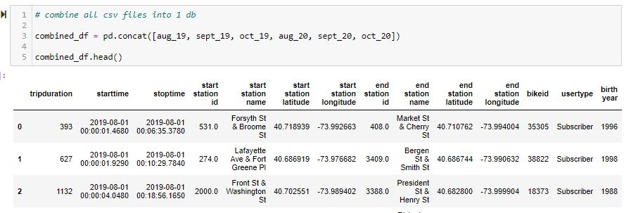

Then I separated out year and month from the start date column. This helped me clearly visualize the date in my tableau story. 

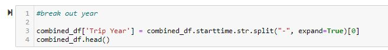

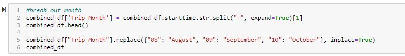

Rider gender was represented by number values in the original data set so I assigned ‘male’ and female’ values in place of the numbers to be more meaningful. 

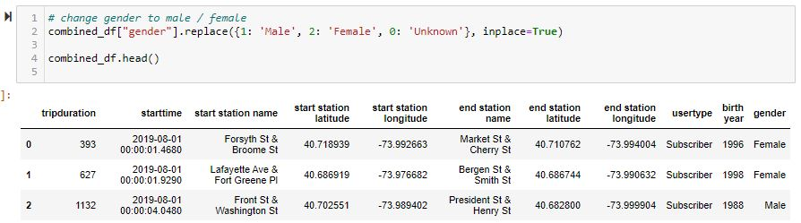

To display age in my visualizations, I calculated the rider age by subtracting the birth year given in the data by the trip year. I created a new column for rider age.

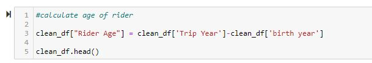

I included the ‘unknown’ genders and outliers for ride age in my data sets but I filtered them out of the final visualizations for clarity. 

## Data Aggregation

The date from citibike was exceptionally large and was too big to use in Tableau in its original form. I created different aggregations of the data sets to make smaller data frames that would be ok to use in Tableau Public. The smaller data frames also made visualizations easier to display. 

To create the total citibike trips per year, I used the `.groupby` function to group the data by Trip Year and Trip month and count the total trips. 

` month_df = clean_df3.groupby(['Trip Year','Trip Month']).count() `

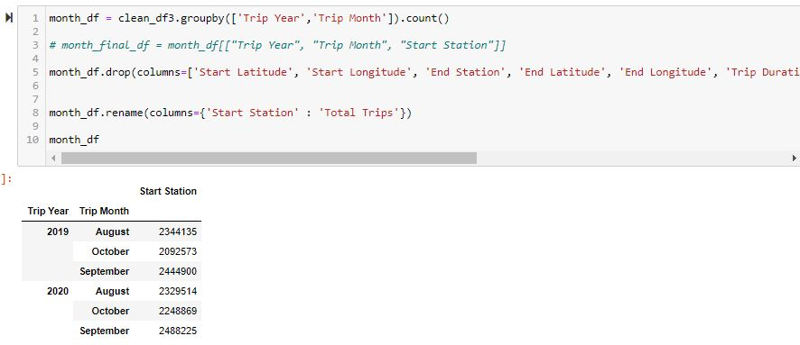

To create the user data frame, I used the `.groupby` function and grouped the data by Trip Year, Trip Month, Rider Gender, Rider Age, and User Type. I added ` .count() ` to calculate the sum of each group. 

` user_df1 = user_df.groupby(["Trip Year", "Trip Month", 'Rider Gender', 'Rider Age', 'User Type']).count() `

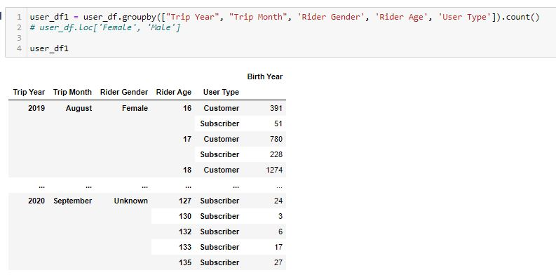

## Visualizations 

To create visualizations in Tableau, I imported my data sets and joined them on common such as station name and longitude and latitude. 

I used common filters in my visualizations such as year, gender, and age. The main purpose of my story was to compare ridership and trip location from 2019 and 2020. I used a filter for Trip Year to create the same charts for each year. 

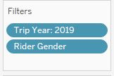

As part of the story telling process, I played with different versions of visualizations displaying the same data to see which more impactful and clearer. Below you can see two versions of Ridership by age and gender. The Bar chart has more specific data displayed clearly, but the overall look of the chart is overwhelming. 
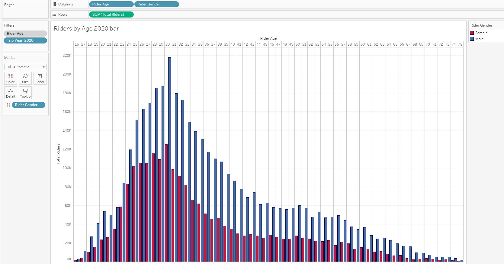

The line chart shows less details but is clear and clean as a visualization.

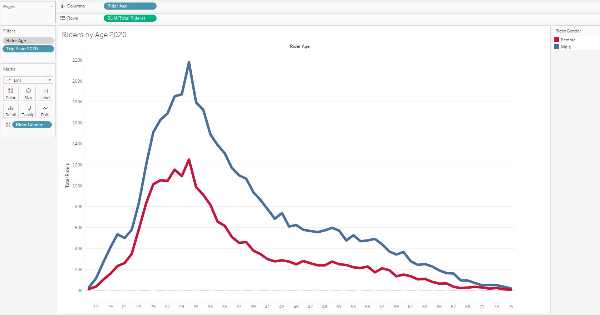

For the map visualizations, I used the Longitude as the column value and the latitude as the row value. I then plotted the points as station totals. 

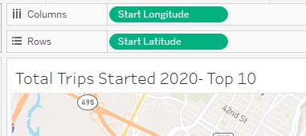

I used color to show the value of the map points. I also added specific tool tips to display all relevant data points associated to station locations. 

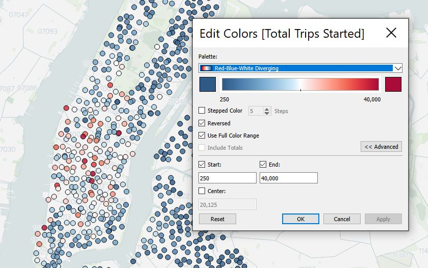

To add the zip code layer, I used Map Layers. 

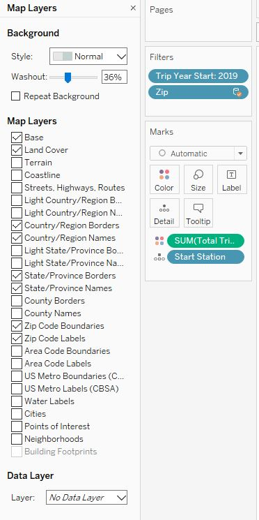

I used the ‘create set’ calculation when creating my visualizations showing the Top 10 trip stations. 

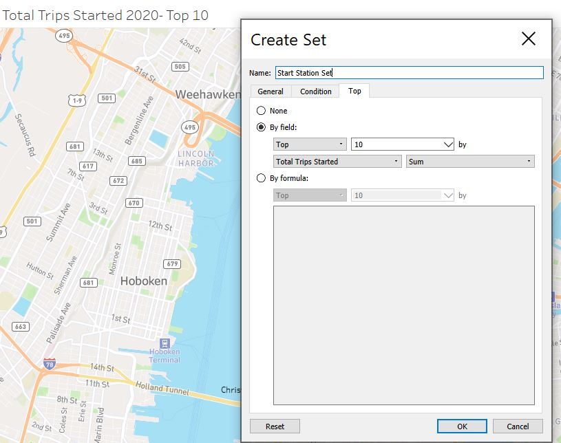

## Analysis

After reviewing the visualizations, I concluded the following:

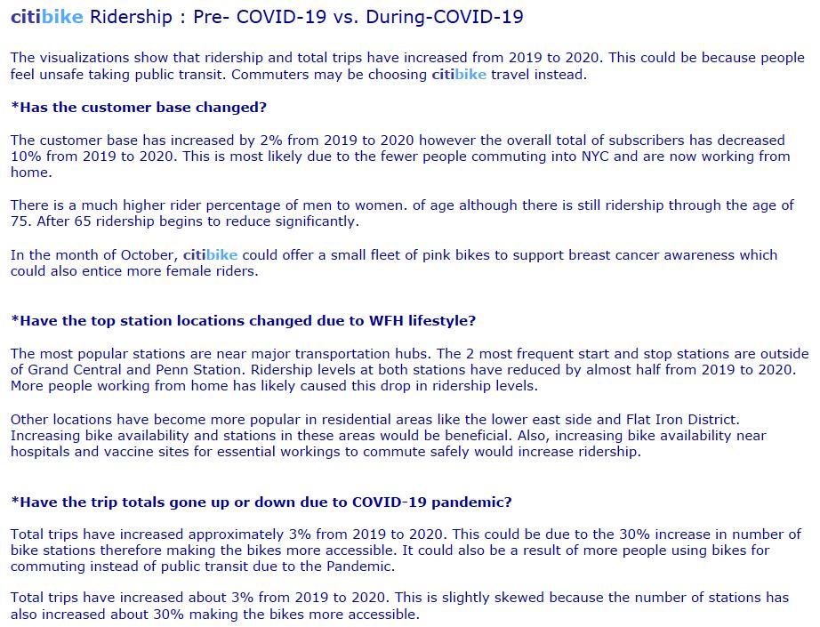

## Tableau Story

Below is the final Tableau Story. You can also view it on the Tableau Public site- [citibike Analysis](https://public.tableau.com/profile/sara7063#!/vizhome/CitiBike_Analysis_16131005084360/citibikeAnalysis)

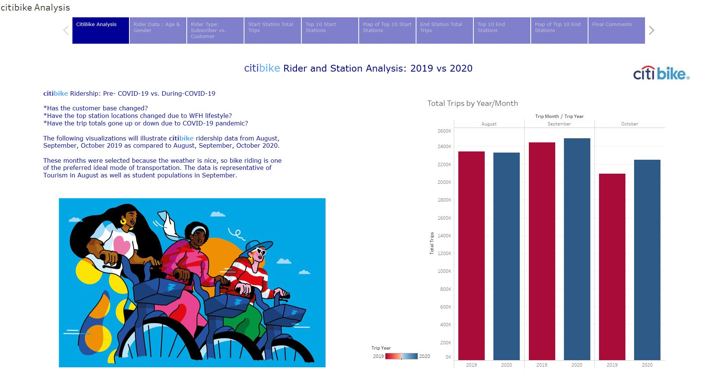

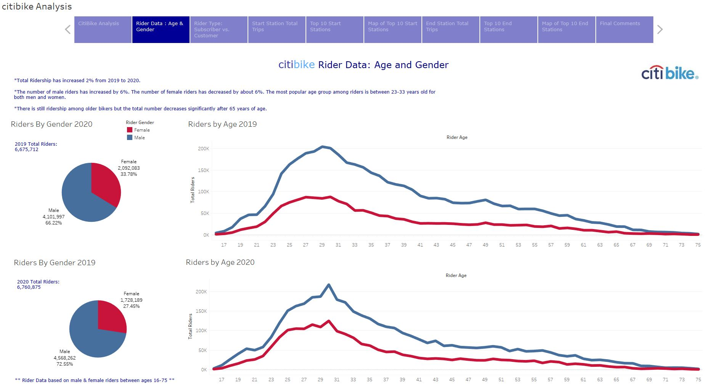

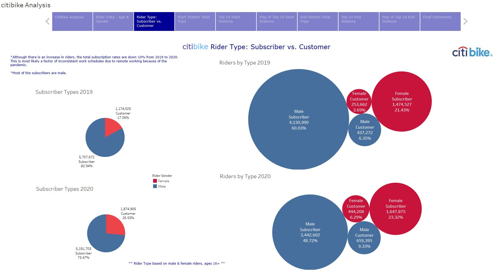

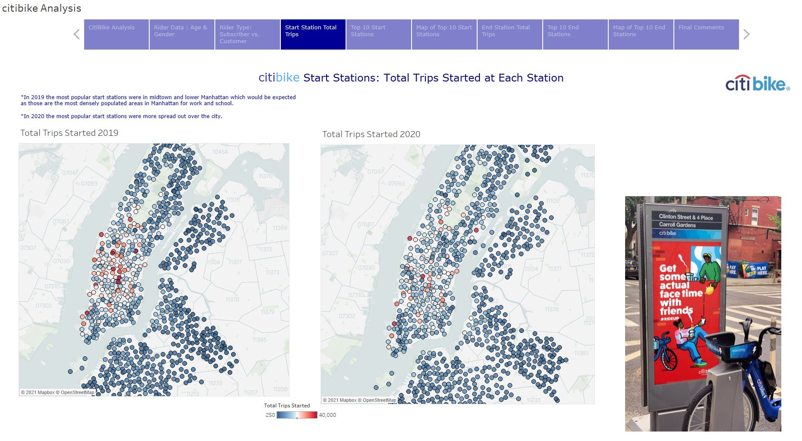

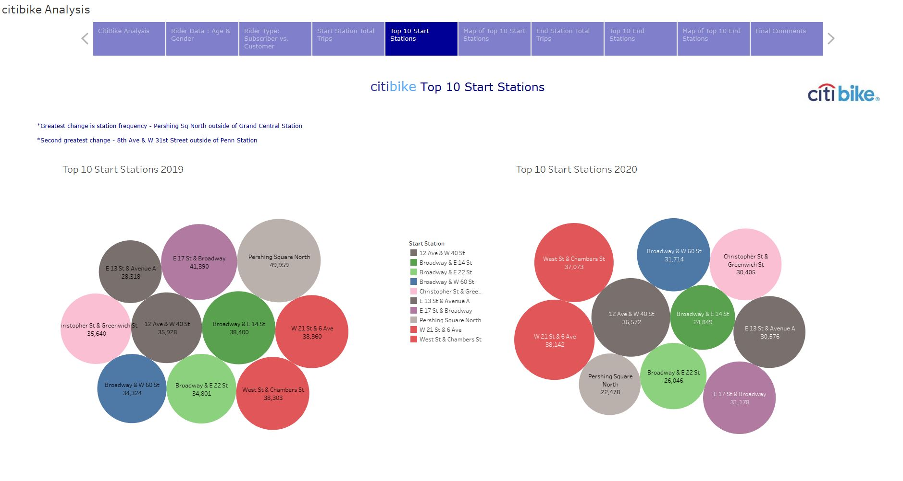

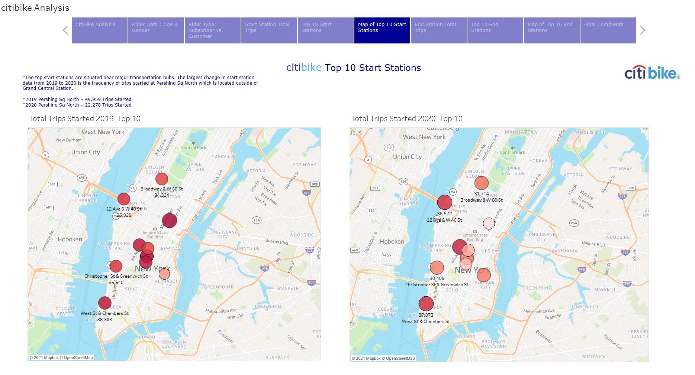

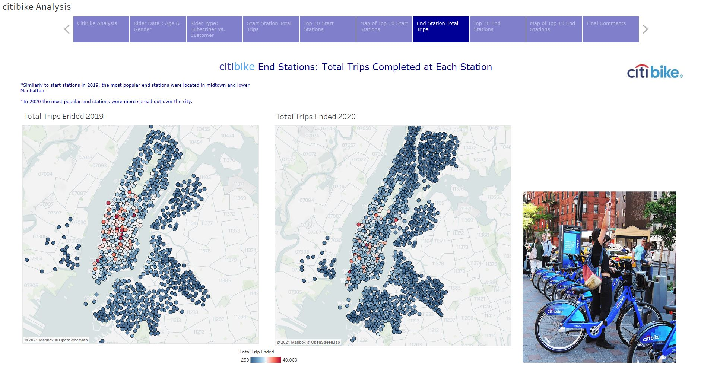

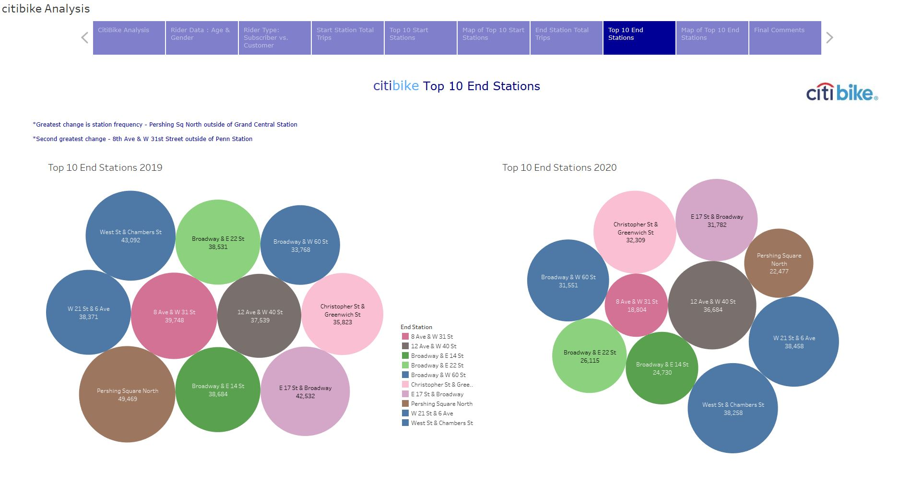

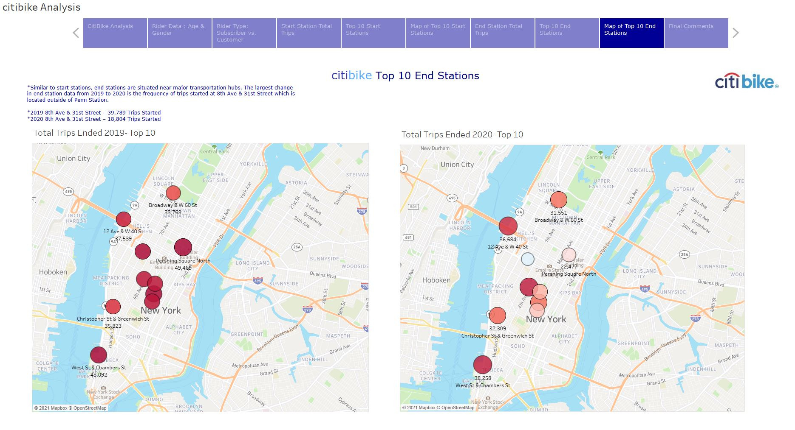

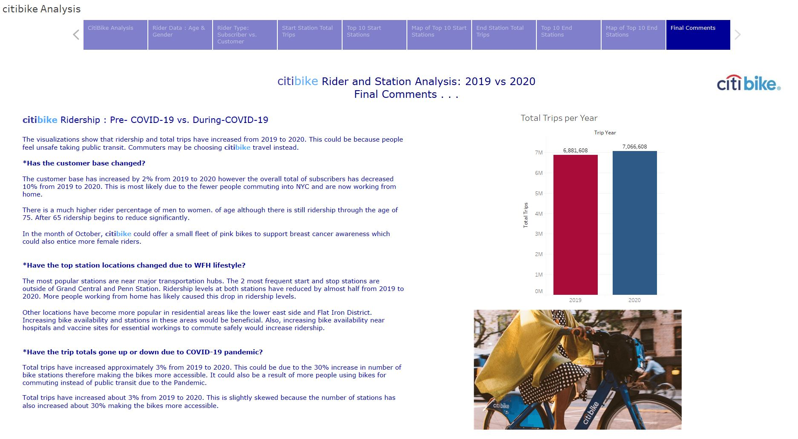

## Resources

CitiBike Data Sources:

[201907-citibike-tripdata.csv](https://s3.amazonaws.com/tripdata/201907-citibike-tripdata.csv.zip)

[201908-citibike-tripdata.csv](https://s3.amazonaws.com/tripdata/201908-citibike-tripdata.csv.zip)

[201910-citibike-tripdata.csv](https://s3.amazonaws.com/tripdata/201910-citibike-tripdata.csv.zip)

[202008-citibike-tripdata.csv](https://s3.amazonaws.com/tripdata/202008-citibike-tripdata.csv.zip)

[202009-citibike-tripdata.csv](https://s3.amazonaws.com/tripdata/202009-citibike-tripdata.csv.zip)

[202010-citibike-tripdata.csv](https://s3.amazonaws.com/tripdata/202010-citibike-tripdata.csv.zip)

## Contact

[Sara Simoes](https://github.com/Ssimoes48)
